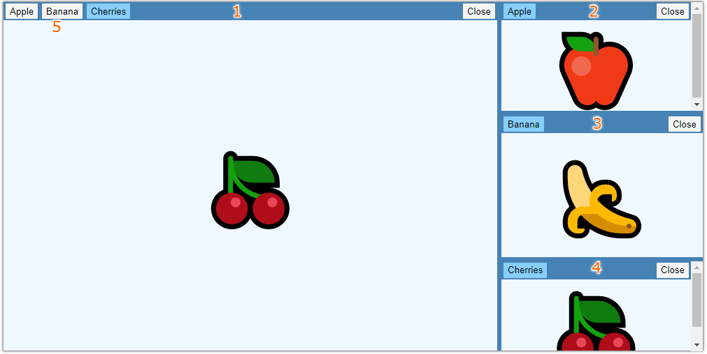

# floaty

Rearrangeable panels in React.

## Installation

**Node.js**

```shell
npm install --save floaty
```

## Examples

```shell
npm run start:dev
```

## Introduction

This part will introduce the concepts and capabilities of `floaty`.

### Concepts

`floaty` is a React component.
It renders a **layout**.
You must specify the *layout* in the `props` of the `floaty` React component.

The *layout* is made up from smaller building blocks.
Each building block is also rendered by its own React component.
A *layout* is made up from the following building blocks:

- Rows.
- Columns.
- Stacks.
- Tabs.

A **row** represents a vertically separated panel.
A **column** represents a horizontally separated panel.
A **stack** represents a "depth" separated panel.
A **tab** represents user generated content; this is where you can render actual content.

The following image demonstrates these concepts:



In the above image, the *layout* is build up as follows:

- A *row* separating the left sections (1) and right sections (2, 3, 4).
  - Left: a *stack* with 3 tabs (5) in the left section.
  - Right: a *column* with 3 items (2, 3, 4) in the right section.
    - Top: a *stack* with 1 tab (2).
    - Middle: a *stack* with 1 tab (3).
    - Bottom: a *stack* with 1 tab (4).

When it comes to *rows*, *columns* and *stacks*, they form a **layout tree**.
The bottom elements (or "leaf" elements) of the layout tree must always be *stacks*, and a *stack* is always a leaf element (therefore it cannot have child *rows* or *columns*).

A *stack* can contain multiple *tabs*.
Each *tab* has a **label** and **content**.
When you use `floaty`, you must provide React components to render the *label* and *content* parts of the layout.

### Capabilities

You can give `floaty` a static layout and it will render that layout.

It is also possible to move *tabs* around.
This can be done programmatically or with user interactions.

For example: the user can use their mouse to drag a *tab* around.
When the user drops the *tab* it will be placed into the layout.
During the dragging process, the *tab* is **floating**.
Dropping the *floating tab* on the content of an existing *tab* will change the *layout*.
Depending on where exactly the *floating tab* was dropped, the new layout can have a new *row*, *column* or *stack*.

*Tabs* can also be closed.
This can also be done programatically or with user interactions.
